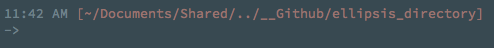

# Ellipsis Directory

A quick hack to insert `..` into long paths for easy viewing in my terminal.

<br>

## Dependencies

- luafilesystem (`luarocks luafilesystem`)

<br><br>

## Usage

`ellipsis_directory.lua <depth>`

<br>

## Installation / Example

Running `ellipsis_directory.lua` will transform your path from something like `~/Documents/Shared/Scripts/Projects/website/html/photos` to a shorter path: `~/Documents/Shared/../../../html/photos`

For this to work, it is necessary to reset your `PS1` environment variable each time a command executes in your terminal. This can be done in a few steps:

- Determine the depth at which you would like have your path shortened.
  - In this example, I am using a depth of `4`
- Create a function to update your `PS1`. This will be execututed with `PROMPT_COMMAND`

```bash
function ellipsis_directory_reload() {
  export PS1+="$(ellipsis_directory.lua 4)"
}
```

- Finally, add this function to your `PROMPT_COMMAND` environment variable

```bash
PROMPT_COMMAND=ellipsis_directory_reload
```

After sourcing your bash profile (or whever your PS1 variable is stored), the path should look like the following:

```
~/Documents/Shared/../../../html/photos
```

### Caveats / Warning

Depending how your environment is set up you may need to include your entire `PS1` variable in the `ellipsis_directory_reload()` command. A live example from my bash environment file:

```bash
nozero() { date +%r | sed 's/\:[0-9]*//2;s/^0//g'; }
yazero() { date +%r | sed 's/\:[0-9]*//2'; }

_ellipsis_directory() {
  # insert the time
  export PS1='\n$(if [[ $(date +%r) =~ ^0 ]]; then nozero; else yazero; fi)'

  # colorize and add open square bracket
  export PS1+=" \[\e[31m\][\[\e[m\]\[\e[31m\]"

  # add the directory via ellipsis_directory, shortening at a depth of 4
  export PS1+="$(${HOME}/Documents/Shared/Dotfiles/elipsis_directory_lua/ed.lua 4)"

  # insert a closing square bracket, add a new line and arrow
  export PS1+="\[\e[m\]\[\e[31m\]]\[\e[m\] \n-> "
}

# finally, add the function to PROMPT_COMMAND
export PROMPT_COMMAND=_ellipsis_directory
```

- The above produces the following bash prompt

</img>

<br><br>

## Note

an observant reader will notice that `..` is not actually an ellipsis.
